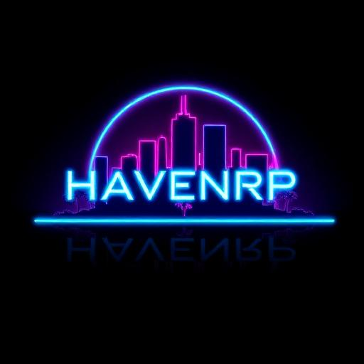

# HavenRP Website

> **Serious Stories. Serious Fun.**

Modern, futuristic website for HavenRP - a FiveM roleplay server. Built with React, TypeScript, and a cyberpunk-inspired neon design system.



## 🚀 Features

### Public Pages
- **Homepage** - Hero section with live server stats, feature showcase, and call-to-action buttons
- **Rules** - Comprehensive server rules with search functionality and sidebar navigation
- **About** - Server story, values, and feature highlights
- **Staff** - Team showcase with roles, bios, and avatars
- **Join/Apply** - Server requirements and joining instructions
- **Store** - Tebex.js NPM package integration with embedded checkout (users never leave your site!)
- **Wiki** - Embedded Notion documentation

### Authenticated Features
- **Discord OAuth** - One-click authentication via Supabase (streamlined, no intermediate page)
- **Dashboard** - Member area with Discord role-based content gating
- **My Characters** - Comprehensive character management
  - Character cards with money (cash, bank, crypto), health percentages, job, and gang
  - Formatted phone numbers `(XXX) XXX-XXXX` with click-to-copy
  - Click-to-copy citizen IDs
  - Full inventory modal with searchable items and metadata
  - Vehicle viewer with comprehensive details
  - Vehicle storage modal (glovebox & trunk) with search
- **Account Dropdown** - Streamlined user menu in navigation (Dashboard, My Characters, Sign Out)

### Real-Time Integrations
- **Live Server Stats** - FiveM player count and server status
- **Discord Members** - Real-time Discord online member count
- **Discord Roles** - Automatic role fetching and display
- **Character Data** - Live FiveM character, inventory, and vehicle sync
- **Vehicle Data** - Real-time vehicle stats, condition, and storage

## 🛠️ Tech Stack

- **Framework:** React 18 + TypeScript
- **Build Tool:** Vite
- **Styling:** Tailwind CSS with custom neon theme
- **UI Components:** shadcn/ui (Radix UI primitives)
- **Routing:** React Router v6
- **State Management:** TanStack Query (React Query)
- **Authentication:** Supabase (Discord OAuth)
- **Icons:** Lucide React + React Icons

## 📦 Installation

```bash
# Clone the repository
git clone https://github.com/yourusername/haven-website.git
cd haven-website

# Install dependencies
npm install
# or
bun install

# Set up environment variables (see below)
cp .env.example .env.local

# Start development server
npm run dev
```

## 🔧 Environment Variables

Create a `.env.local` file in the project root:

```env
# Supabase Configuration
VITE_SUPABASE_URL=your-supabase-project-url
VITE_SUPABASE_KEY=your-supabase-anon-key

# HavenRP API
VITE_DISCORD_ROLES_API_URL=https://api.haven-rp.com/api/discord/roles
VITE_HAVEN_API_KEY=your-havenrp-api-key

# No Tebex environment variables needed - configure in src/config/site.ts
```

### Supabase Setup

1. Create a Supabase project at [supabase.com](https://supabase.com)
2. Enable Discord OAuth in Authentication > Providers
3. Add your Discord app credentials
4. Set redirect URL to `https://yourdomain.com/`
5. Add `VITE_HAVEN_API_KEY` to Supabase Secrets

### Tebex Setup

1. Find your webstore URL (e.g., `havenrp.tebex.io`)
2. Update `tebexWebstoreIdentifier` in `src/config/site.ts`

ℹ️ **Note:** No API keys needed - the store API is public and called directly from the browser.

See [TEBEX_SETUP.md](./TEBEX_SETUP.md) for detailed instructions.

## 📁 Project Structure

```
haven-website/
├── src/
│   ├── components/          # Reusable React components
│   │   ├── ui/             # shadcn/ui components
│   │   ├── Navigation.tsx  # Site navigation with auth
│   │   ├── Footer.tsx      # Site footer
│   │   ├── StatsStrip.tsx  # Live server stats
│   │   └── ...
│   ├── pages/              # Route pages
│   │   ├── Index.tsx       # Homepage
│   │   ├── Dashboard.tsx   # Member dashboard
│   │   ├── MyCharacters.tsx # FiveM characters
│   │   ├── Store.tsx       # Tebex store
│   │   └── ...
│   ├── hooks/              # Custom React hooks
│   │   ├── useDiscordRoles.ts
│   │   ├── useFivemCharacters.ts
│   │   ├── useFivemCharacter.ts
│   │   ├── useFivemVehicles.ts
│   │   ├── useFivemVehicleInventory.ts
│   │   ├── useFivemStats.ts
│   │   ├── useDiscordStats.ts
│   │   ├── useTebex.ts     # Tebex API integration
│   │   └── ...
│   ├── config/             # Site configuration
│   │   └── site.ts         # Centralized config
│   ├── integrations/       # Third-party integrations
│   │   └── supabase/       # Supabase client
│   ├── lib/                # Utility functions
│   └── assets/             # Images and static files
├── public/                 # Public static files
└── ...
```

## 🎨 Design System

### Color Palette
- **Primary (Neon Cyan):** `#00D9FF` - Main accents, links
- **Secondary (Electric Magenta):** `#FF00FF` - Secondary accents
- **Accent (Deep Purple):** `hsl(271 76% 53%)` - Tertiary accents
- **Blue Accent:** `#0099FF` - Additional highlights
- **Background:** Pure black with glass morphism overlays

### Typography
- **Headings:** Poppins / Montserrat (bold, -2% letter spacing)
- **Body:** Inter (400-600 weight)

### Effects
- Neon glows on hover
- Glass morphism cards
- Floating animations
- Smooth scrolling ticker

## 🔌 API Integration

### HavenRP Backend API

The website integrates with a custom HavenRP backend API:

#### Discord Roles
```
GET https://api.haven-rp.com/api/discord/roles/{discordId}
Headers: X-API-Key: {VITE_HAVEN_API_KEY}
```

#### User Characters
```
GET https://api.haven-rp.com/api/fivem/user/{discordId}/characters
Headers: X-API-Key: {VITE_HAVEN_API_KEY}
```

#### Character Details
```
GET https://api.haven-rp.com/api/fivem/character/{citizenid}
Headers: X-API-Key: {VITE_HAVEN_API_KEY}
```

#### Character Vehicles
```
GET https://api.haven-rp.com/api/fivem/character/{citizenid}/vehicles
Headers: X-API-Key: {VITE_HAVEN_API_KEY}
```

#### Vehicle Inventory
```
GET https://api.haven-rp.com/api/fivem/character/{citizenid}/vehicle/{plate}/inventory
Headers: X-API-Key: {VITE_HAVEN_API_KEY}
```

### FiveM Server API
```
GET https://servers-frontend.fivem.net/api/servers/single/{serverCode}
```

### Discord Widget API
```
GET https://discord.com/api/guilds/{guildId}/widget.json
```

### Tebex Headless API
```
# Get store data
GET https://headless.tebex.io/api/accounts/{token}/categories?includePackages=1
GET https://headless.tebex.io/api/accounts/{token}/packages/{id}

# Checkout flow
POST https://headless.tebex.io/api/accounts/{token}/baskets
POST https://headless.tebex.io/api/accounts/{token}/baskets/{ident}/packages
GET https://headless.tebex.io/api/accounts/{token}/baskets/{ident}
```

**Note:** API calls are made directly from the browser (no proxy needed)

**Checkout:** Uses Tebex.js for fully embedded checkout modal

## 📜 Available Scripts

```bash
# Development
npm run dev          # Start dev server (port 8080)

# Build
npm run build        # Production build
npm run build:dev    # Development build

# Preview
npm run preview      # Preview production build

# Linting
npm run lint         # Run ESLint
```

## 🚢 Deployment

### Vercel (Recommended)
1. Push to GitHub
2. Import project in Vercel
3. Add environment variables
4. Deploy

### Manual Build
```bash
npm run build
# Upload dist/ folder to your hosting
```

## 🎯 Configuration

Edit `src/config/site.ts` to customize:

```typescript
export const siteConfig = {
  // FiveM Server
  cfxCode: "kbv7mv",
  fivemConnect: "cfx.re/join/kbv7mv",
  
  // Discord
  discordInvite: "https://discord.gg/havenrp",
  discordGuildId: "1381585365466611732",
  
  // Server Info
  serverName: "HavenRP",
  serverTagline: "Serious Stories. Serious Fun.",
  maxPlayers: 256,
  
  // Social Links
  reddit: "https://www.reddit.com/r/HavenRP/",
  tiktok: "https://www.tiktok.com/@_haven_rp_",
  youtube: "https://www.youtube.com/@Haven-City",
  medal: "https://medal.tv/...",
  
  // News Ticker
  newsTicker: [
    { date: "2025-10-19T00:00:00Z", event: "Flying High Race" }
  ],
};
```

## 🔒 Authentication Flow

1. User clicks "Sign In" button in navigation
2. Supabase directly initiates Discord OAuth (no intermediate page)
3. User authorizes on Discord
4. Redirected back to homepage with active session
5. Navigation updates to show Account dropdown menu
6. Discord ID extracted from session metadata
7. API calls fetch:
   - Discord roles for content gating
   - User's FiveM characters
   - Character inventory and vehicle data on demand
8. Dashboard and My Characters pages populate with live data

## 🎮 Features in Detail

### Role-Based Content Gating
Dashboard shows different content based on Discord roles:
- **Staff/Admin** - Staff resources and tools
- **VIP/Supporter** - Exclusive perks section
- **All Members** - General resources

### Character Management
- **Overview** - View all characters linked to Discord account
- **Stats Display**
  - Money breakdown (cash, bank, crypto) with formatted values
  - Health displayed as value and percentage (max 200)
  - Armor value
  - Job and gang information with grades
  - Formatted phone numbers: `(XXX) XXX-XXXX`
- **Inventory System**
  - Searchable inventory modal with real-time filtering
  - Item metadata (durability, ammo, serial numbers, components)
  - Formatted item names (e.g., "WEAPON_PISTOL" → "Pistol")
  - Grid layout with detailed item cards
- **Vehicle Management**
  - Comprehensive vehicle list sorted by favorites
  - Vehicle categories with color-coded badges
  - Special badges for "1 of 1" and "Import" vehicles
  - Real-time stats: fuel, mileage, engine condition, body condition
  - Condition percentages (max 1000) with color indicators
  - Click-to-copy license plates
  - Searchable by category, type, make, model, or plate
- **Vehicle Storage**
  - Separate glovebox and trunk inventories
  - Searchable storage items
  - Real-time item counts and amounts
  - Nested modal for storage details
- **Copy Features**
  - One-click copy for phone numbers and citizen IDs
  - Visual feedback with checkmark icons
  - Toast notifications on successful copy

### Live Stats
- Real-time FiveM server player count
- Discord online members
- Server status indicator
- Auto-refresh every 60 seconds

## 🔍 Search Features

All modals include real-time search functionality:

### Character Inventory Search
- Filter by item name (original or formatted)
- Instant results with "X of Y" counter
- Case-insensitive partial matching

### Vehicle Search
- Filter by category (Super, Sports, Off-Road, etc.)
- Filter by type (1of1, Import, Regular)
- Search by make/brand (e.g., "Grotti", "Pegassi")
- Search by model (e.g., "Turismo", "Zentorno")
- Search by license plate
- "Showing X of Y vehicles" counter
- Empty state with helpful message

### Vehicle Storage Search
- Filter glovebox and trunk simultaneously
- Search by item name
- Individual section counters
- Real-time filtering

## 📚 Documentation

Additional documentation coming soon.

## 🤝 Contributing

This is a private project for HavenRP. For issues or feature requests, contact the development team.

## 📄 License

Private & Confidential - © 2025 HavenRP. All rights reserved.

---

**Built with ❤️ for the HavenRP Community**
